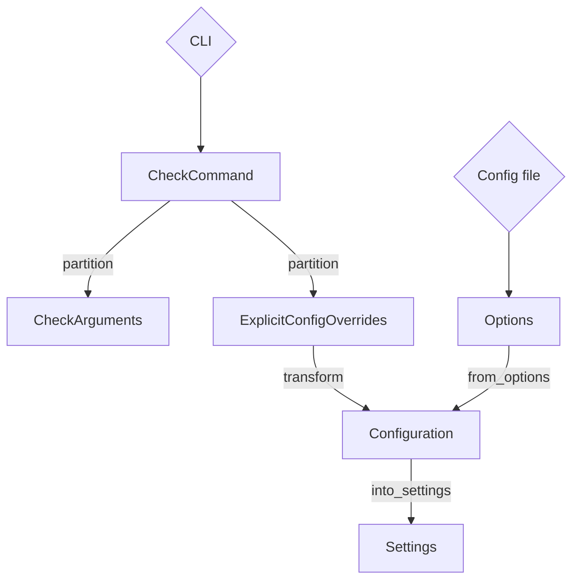

# Contributing to Fortitude

First off, thank you for wanting to contribute to Fortitude! We're very glad of
community support, and welcome all sorts of contributions, from rule suggestions
to bug fixes and new features.

## The Basics

Fortitude welcomes contributions in the form of pull requests and issues.

Please look through existing
[**issues**](https://github.com/PlasmaFAIR/fortitude/issues) to see if there
is some discussion about a proposed change already.

We've tried to label [beginner-friendly issues][first-issue] which might be
suitable for newcomers to tackle, as well as known [bugs][bug-issue] and
proposed [features][feature-issue] if you're looking to contribute but stuck for
ideas!

[first-issue]: https://github.com/PlasmaFAIR/fortitude/issues?q=is%3Aissue%20state%3Aopen%20label%3A%22good%20first%20issue%22
[bug-issue]: https://github.com/PlasmaFAIR/fortitude/issues?q=is%3Aissue%20state%3Aopen%20label%3Abug
[feature-issue]: https://github.com/PlasmaFAIR/fortitude/issues?q=is%3Aissue%20state%3Aopen%20label%3Aenhancement

### Code of Conduct

This project and everyone participating in it is governed by the [Fortitude Code
of Conduct](https://github.com/PlasmaFAIR/fortitude/CODE_OF_CONDUCT.md). By
participating, you are expected to uphold this code.

### Prerequisites

Fortitude is written in Rust. You'll need to install the
[Rust toolchain](https://www.rust-lang.org/tools/install) for development.

You'll also need [Insta](https://insta.rs/docs/) to update snapshot tests:

```shell
cargo install cargo-insta
```

You'll need [uv](https://docs.astral.sh/uv/getting-started/installation/) (or `pipx` and `pip`) to
run Python utility commands.

We recommend [nextest](https://nexte.st/) to run Fortitude's test suite (via `cargo nextest run`),
though it's not strictly necessary:

```shell
cargo install cargo-nextest --locked
```

Throughout this guide, any usages of `cargo test` can be replaced with `cargo nextest run`,
if you choose to install `nextest`.

## Building and running from source

To build Fortitude from source, you must first have a working Rust environment
(see [rustup](https://rustup.rs/)). An executable may then be built with the
following command called from the project root directory:

```bash
cargo build
```

This will build an executable in debug mode at `./target/debug/fortitude`. To
test the release version:

```bash
cargo build --release
```

This will instead build an executable at `./target/release/fortitude`.

The project can also be run without prior building using the command:

```bash
cargo run [--release]
```

For example, to test Fortitude over a local project:

```bash
cargo run [--release] check /path/to/my/project
```

## Installation from source

Normally during development it is preferable to use one of the above methods to
build and run Fortitude, but there are instances where you may wish to test
installing the project from source. The project may installed from the project
root directory using either `pip`:

```bash
# Generate virtual environment (recommended!)
python -m venv .venv
# Or better yet, for uv users:
uv venv

# Activate virtual environment
source .venv/bin/activate

# Install and include linting/formatting utilities
pip install .[lint]
# Or for uv users...
uv pip install .[lint]
```

Or using `cargo`:

```bash
cargo install --path fortitude
```

## Testing

Unit tests can be run by calling:

```bash
cargo test --workspace
```

You'll also need [Insta](https://insta.rs/docs/) to update snapshot tests:

```shell
cargo install cargo-insta
```

## Linting and Formatting

When contributing, please use `cargo clippy` for linting and `cargo fmt` for formatting.
If you edit any Python code, please also use `ruff check` and `ruff format`. To avoid
accidentally pushing unlinted/unformatted code to GitHub, we recommend using
[`pre-commit`](https://pre-commit.com/) with the provided config file:

```bash
pip install pre-commit; pre-commit install
# Or, to avoid installing something to your environment...
pipx run pre-commit install
# Or, even better yet for those using uv...
uvx pre-commit install
```

## Adding Rules

We're always open to new rule suggestions, and would be very grateful for any
assistance in implementing them. Before raising an issue to suggest a new rule,
please check to see if it has already been
[suggested](https://github.com/PlasmaFAIR/fortitude/issues?q=is%3Aissue+is%3Aopen+label%3Arule).

There are several steps required to add a new rule to Fortitude:

1. Decide on a name and category following our [naming
   rules](#naming-and-categorising-rules).
2. Create a new file
   `crates/fortitude_linter/src/rules/<category>/<rule_name>.rs`, where `<category>` is your chosen rule
   category and `<rule_name>` is its name.  If there is already a file for a
   similar rule, you may also choose to add your rule there.
3. In that file, define a `Violation` struct. This defines the diagnostic
   messages raised when your rule is violated.
4. Implement one of `TextRule`, `AstRule` or `PathRule` for your `Violation`. These
   are, respectively, rules that check a file line-by-line, rules that analyse the
   AST, and rules that analyse the path to a Fortran file directly.
    - Most rules are `AstRules`, which use [`tree_sitter`](https://docs.rs/tree-sitter/latest/tree_sitter/)
      to analyse the code. If you want to see how `tree_sitter` parses a given file,
      we recommended installing `tree_sitter`, cloning
      [`tree_sitter_fortran`](https://github.com/stadelmanma/tree-sitter-fortran),
      and then running the following from the `tree_sitter_fortran` root directory:
```bash
tree-sitter build
tree-sitter parse /path/to/fortran/file.f90
```
5. Map the `Violation` struct to a rule code in `fortitude/src/rules/mod.rs`.
    - `code_to_rule` is never called directly, but the match statement within is
      analysed by the macro `fortitude_macros::map_codes` to define a `Rule` enum
      and many associated utilities.
    - The first two digits for a rule code normally define a subcategory, while the
      last digit denotes the specific rule within that subcategory. The last digit
      should not be zero. For example, `C07x` defines rules related to the use of
      assumed-size arrays and character strings.  This isn't stringently
      enforced, but you may be asked to renumber the rule if other developers
      think it would better fit somewhere else.
    - New rules should be in `RuleGroup::Preview`.
6. Add a [test](contributing.md#rule-testing-fixtures-and-snapshots) for your rule. Try to
   consider edge cases and any scenarios where false positives could occur.
7. Update the generated documentation using `cargo dev generate-all`.

You can automatically add a lot of this boilerplate by running
[scripts/add_rule.py](https://github.com/PlasmaFAIR/fortitude/scripts/add_rule.py):

```bash
python3 scripts/add_rule.py --name MyNewRule --prefix C --code 123 \
  --category correctness
```

This runs steps 2-6 above for an AST rule. You can also use this for
other kinds of rules, you'll just need to manually change the `impl
AstRule` block to the correct one in the new rule file, and the new
line added in `rules/mod.rs`.

It can be very helpful to look at the AST for a sample file to know
what to look for when writing your rule: run `cargo dev print-ast` to
see a pretty-printed AST. You can add `--cst` to see a "concrete
syntax tree" that includes unnamed nodes.

For some rules, it may be possible to automatically apply a fix for the user,
though it isn't essential to include a fix when adding a new rule. These are
typically applied using
[`Fix`](https://github.com/astral-sh/ruff/blob/main/crates/ruff_diagnostics/src/fix.rs)
and
[`Edit`](https://github.com/astral-sh/ruff/blob/main/crates/ruff_diagnostics/src/edit.rs)
from Ruff. A fix may be one of:

- 'Safe': Applying the fix is guaranteed to not change the behaviour of the
  user's program. This will normally only apply to stylistic changes.
- 'Unsafe': Applying the fix may change the behaviour of the user's program in
  some edge cases.
- 'Display only': Fortitude can guess at a solution, but makes no guarantees
  to its correctness or safety.

If you help writing rules, we recommend checking the implementation of existing
rules to see if anything similar already exists. You can also raise a draft pull
request to ask for assistance from other developers.

### Naming and Categorising Rules

Similarly to
[Ruff](https://docs.astral.sh/ruff/contributing/#rule-naming-convention), the
name of a rule should describe the pattern the rule is intended to fix. Words
such as 'forbid' should be omitted. For example, the name for the rule that
warns of overly long lines is `LineTooLong`, and not something like
`AvoidLineTooLong` or `KeepLinesShort` (note: the rule struct should be named in
`PascalCase`/`UpperCamelCase` -- Fortitude will automatically convert this to
`kebab-case` for the user facing names)

Rules should also be categorised appropriately. For example, if a rule is
intended to discourage the use of outdated features, it may go under
`Obsolescent`. If it discourages bug-prone coding patterns, it should go
under `Correctness`. If the rule only affects code readability, it should go
under `Style`.

The boundaries between categories are not always clear, so the exact name and
category of a rule is often determined following a discussion after a pull
request has been raised.

### Rule Testing: Fixtures and Snapshots

To test rules, Fortitude uses snapshots of Fortitude's output for a given file (fixture). Generally, there
will be one file per rule (e.g., `E402.f90`), and each file will contain all necessary examples of
both violations and non-violations. `cargo insta review` will generate a snapshot file containing
Fortitude's output for each fixture, which you can then commit alongside your changes.

Once you've completed the code for the rule itself, you can define tests with the following steps:

1. Add a Fortran file to `crates/fortitude_linter/resources/test/fixtures/[category]` that contains the code you
    want to test. The file name should match the rule name (e.g., `E402.f90`), and it should include
    examples of both violations and non-violations.

1. Run Fortitude locally against your file and verify the output is as expected. Once you're satisfied
    with the output (you see the violations you expect, and no others), proceed to the next step.
    For example, if you're adding a new rule named `E402`, you would run:

    ```shell
    cargo run -- check crates/fortitude_linter/resources/test/fixtures/typing/E402.f90 --select E402
    ```

    **Note:** Only a subset of rules are enabled by default. When testing a new rule, ensure that
    you activate it by adding `--select ${rule_code}` to the command, and if the rule is in the `Preview`
    category, add `--preview` as well.

1. Add the test to the relevant `crates/fortitude_linter/src/rules/[category]/mod.rs` file. If you're contributing
    a rule to a pre-existing set, you should be able to find a similar example to pattern-match
    against. If you're adding a new category, you'll need to create a new `mod.rs` file (see,
    e.g., `crates/fortitude_linter/src/rules/typing/mod.rs`)

1. Run `cargo test --workspace`. Your test will fail, but you'll be prompted to follow-up
    with `cargo insta review`. Run `cargo insta review`, review and accept the generated snapshot,
    then commit the snapshot file alongside the rest of your changes.

1. Run `cargo test --workspace` again to ensure that your test passes.

## Adding Options

Fortitude has a complicated system for determining a user's configuration, as it must
take into account:

- Default settings
- Configuration file settings from various sources:
  - Project level, such as `/path/to/project/fortitude.toml`
  - User level, such as `$HOME/.config/fortitude/fortitude.toml`
  - Passed directly: `fortitude --config-file=myconfig.toml check`
- Command line settings (which may override config file settings)

Config files within a project can also be hierarchical, so those nested deeper in
the directory structure modify the settings set at the top level.

To handle this, options are determined and transformed via the following structs:



- `CheckCommand::partition` takes care of merging things like `--fix` and
  `--no-fix`, and splits options into two structs: `CheckArguments` which is
  CLI-specific stuff, and `ExplicitConfigOverrides` which are explicit CLI
  arguments that override config file options.
- `Configuration::from_options` makes a new instance from the config file
  `Options`.
- `transform` makes sure `ExplicitConfigOverrides` takes priority over the base
  `Configuration`, whether that's the default or from file
- Lastly, `Configuration::into_settings` gives us a `Settings` where everything
  has been concretised (that is, nothing is an `Option<T>` so we don't have to
  handle anything being `None` after this).

When adding a new option to Fortitude, it's important to ensure that it is added
at all relevant stages of the flowchart above. It's also worth considering
whether the option makes sense as a command line option, a configuration file
option, or both.

If you are unsure about how to add a new option, please feel free to raise an
[issue](https://github.com/PlasmaFAIR/fortitude/issues), and we will be happy to
assist!

## Building Docs

The documentation can be built locally using:

```bash
pip install -r requirements.docs.txt
cargo dev generate-all
mkdocs serve
```

## Making New Releases

To make a new release, the following steps must be completed in order:

1. Move rules out of preview mode/into deprecated mode (if applicable).

1. Make sure the generated docs are up-to-date: `cargo dev generate-all`

1. Install `uv`: `curl -LsSf https://astral.sh/uv/install.sh | sh`

1. Install [`gh`](https://cli.github.com/) and login with `gh auth login`

1. Run `./scripts/release.sh`; this command will:

    - Generate a temporary virtual environment with `rooster`
    - Generate a changelog entry in `CHANGELOG.md`
    - Update versions in `pyproject.toml` and `Cargo.toml`
    - Update references to versions in the `README.md` and documentation
    - Display contributors for the release

1. `rooster` currently doesn't update `CITATION.cff`, so this needs to be done
   manually for now

1. Some sections of the docs also directly reference the version number and
   need to be manually updated. Use `grep <current_version> docs -r` to find
   them.

1. The changelog should then be editorialised for consistency

    - Often labels will be missing from pull requests they will need
      to be manually organized into the proper section
    - Changes should be edited to be user-facing descriptions, avoiding internal details

1. Highlight any breaking changes in `BREAKING_CHANGES.md`

1. Run `cargo check`. This should update the lock file with new versions.

1. Create a pull request with the changelog and version updates

1. Merge the PR

1. Update the tag on `main`

1. Run the [release workflow](https://github.com/PlasmaFAIR/fortitude/actions/workflows/release.yml) with:

    - The new version number

1. The release workflow will do the following:

    1. Build all the assets. If this fails (even though we tested in step 4), we
       haven't tagged or uploaded anything, you can restart after pushing a
       fix. If you just need to rerun the build, make sure you're [re-running
       all the failed
       jobs](https://docs.github.com/en/actions/managing-workflow-runs/re-running-workflows-and-jobs#re-running-failed-jobs-in-a-workflow)
       and not just a single failed job.
    1. Upload to PyPI.
    1. Create and push the Git tag (as extracted from `pyproject.toml`). We
       create the Git tag only after building the wheels and uploading to PyPI,
       since we can't delete or modify the tag
       ([#4468](https://github.com/astral-sh/ruff/issues/4468)).
    1. Attach artifacts to draft GitHub release

1. Verify the GitHub release:

    1. The Changelog should match the content of `CHANGELOG.md`
    1. Append the contributors from the `scripts/release.sh` script

Pushing to `crates.io` is currently not possible as some of our dependencies point
to GitHub repositories. We'll be able to restart using `crates.io` if Ruff starts
publishing there.
